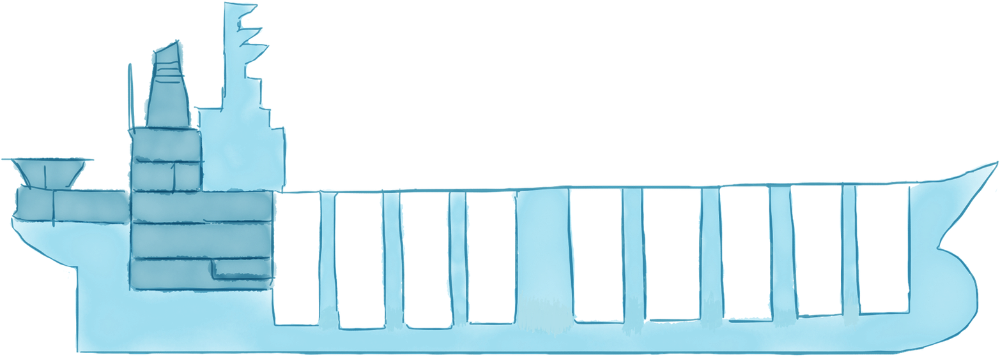

Reactive微服务是什么？
=========================== 
采用基于微服务架构一个重要原则是分而治之（[Divide and Conquer](https://en.wikipedia.org/wiki/Divide_and_conquer_algorithms)）：把系统的组件打散然后隔离成子系统，它们之通完清晰的协议进行通信。

隔离是实现高可用和可伸缩性的先决条件，它要求服务之间用异步通信的方式来解耦：

*时间*    
    可以并发

*空间*    
    可以分布式和可移动的（可随意移动服务的能力） 

		当我们实现微服务，它的本质就是消除共享易变状态（shared mutable state）[*注1*]从而使协调（coordination）、资源竞争、和一性成成本最小化，这些在非共享架构（[Shared nothing architecture](https://en.wikipedia.org/wiki/Shared_nothing_architecture)）中的通用可扩展性系统法则（Universal Scalability Law）[*注1*]有所定义。		

这个观点会贯穿全文，是时候让我们来讨论Reactive微服务最重要的部分了。

隔离所有
===========================

> 没有伟大的孤独，哪有严肃的作品 ---  巴勃罗·毕加索

隔离是非常重要的物质，它是微服务许多高层优势（`high-level benefits`）的基础，然后它同时是影响你的设计和架构的最大因素。它会（应该）拆分整个架构，因此一开始就要考虑它。它甚至会使你打破原来方式，重新组建团队和分配职责，正如梅尔文.康威（`Melvyn Conway`）的发现然后在1976年编写了[康威定律](http://melconway.com/Home/Conways_Law.html)：   

> 任何组织设计一个系统（广义上的系统）都会产生一种设计，其结构为其组织通信结构的复本。 

失败隔离，控制和管理工作流的服务失败防止雪崩 --- 这模式有时候会提到隔板这概念。

隔板已经在般身结构设计运行好几个世纪了，例如这样的方式『建造水密舱，当船外壳被破坏或其他裂缝的情况可以控制进水情况』[*注3*]。般被分为截然不同、完全隔离的水密舱，裂缝不会扩散，般可以继续运行到达目的地。

有人会认为泰坦尼克号就是个反例。实际上，有个有趣的研究[*注4*]表明了当你没有适当的隔离舱是如何导致雪崩，最后导致整个系统崩溃。泰坦尼克号确实是使用隔板技术，但是水密舱的墙壁假设水位不会超过开花板。所以当16分之6的水密舱被冰块刺穿，整艘般开始倾斜，水从一个水密舱溢出到另外一个，直到所有水密舱都充满了水然后下沉，1500死亡。

恢复力，从失败中自愈的能力 -- 依靠地隔离和控制失败，达到这个目的只能是打破同步通信带来的强耦合。微服务在程序边界通过异步消息传递能实现间接调用，是捕获和管理失败的前提。针对平常的流程，使用服务监督（`service supervision`）[*注5*]。

服务之间隔离使持续交付变得自然，它允许我们安全地一个接一个发布程序、减小节点、回滚。

隔离还可以使服务之间更容易扩展，同样允许他们自监控、调试和独立测试 --- 笨重的单体系统中的服务都缠在一起，这是很难道做到这一点的。

----------------------------		
[注1]. 一次对易变状态产生的问题的深入讨论，请看John Backus的经典图灵奖演讲『[编程可以从冯诺依曼风格中解放出来吗？](http://delivery.acm.org/10.1145/360000/359579/a1977-backus.pdf)』 

[注2]. Neil Gunter的通用可扩展性系统法则（[Universal Scalability Law](http://www.perfdynamics.com/Manifesto/USLscalability.html)）是理解一致性和协调对并发和分布式系统的影响的重要途径。

[注3]. 在般身结构运用隔板的讨论，请看WIKI页面[Bulkhead](https://en.wikipedia.org/wiki/Bulkhead_(partition))

[注4]. 深度分析泰坦尼克号沉没的原因，请看[泰坦尼克号快速沉没的原因和影响](http://writing.engr.psu.edu/uer/bassett.html)

[注5]. 单元（服务）监督在Actor语言（像Erlang）和类库（像Akka）用于管理失败。监督者层级模式以分层的方式在父进程监督下组织单元（Actor/服务），请看[监督与监控](http://doc.akka.io/docs/akka/snapshot/general/supervision.html)

